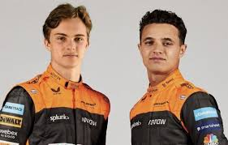

# 517-Reddick-Formula-One
 
 Repo #2 on Formula One

## Introduction to Formula 1 Racing

[Formula 1](https://www.formula1.com/) is the highest tier of racing within the larger organization that is over other formula series such as Formula 2, 3, and 4. Formula 1 is a racing series that has reached global status as the premier stage for drivers to prove themselves by racing around some of the worlds toughest and fastest tracks. The cars that are driven by these drivers are some of the fastest in the world and are being produced by companies who are on the edge of the automotive engineering world. The tracks these cars are tested on span continents; some of these tracks being located on the streets of [Monaco] or in the forest of [Belgium]. Today we are going to highlight one Formula 1 team that has a storied history within the sport whose story will help us learn more about Formula 1 as a whole. 

## McLaren F1 Team  
### Brief History of McLaren within Formula 1

McLaren Racing Limited was founded in Surrey, England by a subsidary team of the parent company, McLaren Group. It is the second oldest team still active in Formula 1 today having won 185 races total, producing 12 [drivers' championships](https://www.formula1.com/en/results/2024/team) and 8 [constructors' championships](https://www.formula1.com/en/results/2024/drivers). The team founded by Bruce McLaren, won its first race at the 1968 Belgian Grand Prix with their [McLaren M7A race car]. The team found mild success throughout the the rest of the 60's and early 70's but would quickly have some of the best drivers Formula 1 would ever see racing for them. The team would go on to see great success in the 80's and 90's winning the 85',86',89',88',90', and 91' driver championships while providing incredible automotive breakthroughs to groundbreaking drivers such as Aryton Senna. Today, McLaren has seen some downfalls and is considered a "midpack" team often times but is slowly trying to recapture previous success. The current drivers for the 2024 season are Oscar Piastri and Lando Norris

   **The McLaren M7A**

**Oscar Piastri (Left) and Lando Norris (Right)**

### Notable Drivers for McLaren

* Ayrton Senna
    * Races Won: 41
    * **Championships**: 3

* Alain Prost
    * Races Won: 51
    * **Championships**: 4

* James Hunt
    * Races Won: 10
    * **Championships**: 1

### Top 5 Most Winning Drivers of All Time in Formula 1

1. Lewis Hamilton  
_Lewis Hamilton has won 105 races over his career_
2. Michael Schumacher  
_Michael Schumacher won 91 races during his active career before retirement_
3. Max Verstappen  
 _Max Verstappen is quickly approaching Lewis Hamilton's records with many years of racing left!_
4. Sebastian Vettel  
_Sebastian Vettel won 53 races over the span of his career and all of his championships were won with Red Bull F1 Team_
5. Alain Prost  
_Alain Prost won 51 races over the span of his career, many with McClaren_

[Monaco]: https://www.formula1.com/en/information/monaco-circuit-de-monaco-monte-carlo.2ZWRtIcSI6ZzVGX1uGRpkJ
[Belgium]: https://www.formula1.com/en/racing/2024/belgium/circuit

